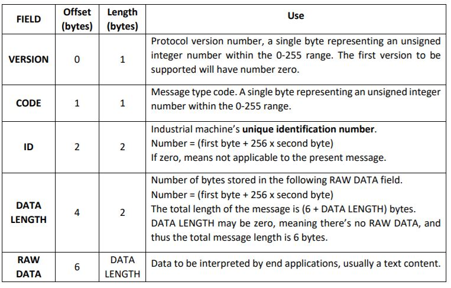

# Relatório RCOMP - SPRINT C #

# UC_1011_Simulate_Machine_Operation #

* A aplicação visa a simulação de uma máquina industrial real ou a um software que simula o funcionamento geral de uma máquina industrial. Estas enviam mensagens para o sistema central e também recebem mensagens do sistema central e/ou do sistema de monitorização. O protocolo de aplicação consiste no envio de mensagens, sendo que o envio de uma mensagem inclui sempre o envio de um pedido (request) e a receção de uma resposta (response).
Foi utilizado o protocolo TCP para o envio de uma mensagem o que implica o estabelecimento de uma conexão TCP sobre a qual é enviado o pedido e assim que a resposta seja obtida a conexão é fechada.

* A construção da mensagem foi efetuada tendo em conta sempre a seguinte tabela:

# Descrição do caso de uso #

* Este caso de uso será utilizado para simular o funcionamento de uma máquina, nomeadamente no envio de mensagens geradas por estas.

* As máquinas industriais são identificadas através de um número de identificação único (unique identification number), que corresponde a um número inteiro positivo entre 1 e 65535.
As mensagens a enviar são lidas de um ficheiro de texto. Para causar um efeito de simulação, as linhas do ficheiro são lidas uma de cada vez com um intervalo de tempo estipulado nos parametros aquando da execução do programa.
A identificação da máquina, o ip, o nome do ficheiro e a cadência de envio são estipuladas por parametro.

### FUNCIONAMENTO DA COMUNICAÇÃO ###

* Será utilizada a porta **30901** para comunicação entre sistemas.
* Inicialmente o Sistema de Simulação da Máquina envia um *HELLO request* para a porta **30901**.
* O servidor responde-lhe com um NACK ou ACK, dependendo da máquina que está a tentar estabelecer conexão.
* Caso a resposta seja ACK, é permitida a leitura do ficheiro para a simulação do envio de mensagens. Posteriormente é enviada uma *Message request* seguindo o protocolo descrito no enunciado. Caso contrário, a conexão é recusada e a ligação é fechada.
* O servidor responde-lhe com um ACK ou NACK dependendo da máquina que envia o pedido. Caso a resposta seja ACK, este permite continuar a leitura e envio de mensagens, caso contrário a conexão será fechada. Foi adicionado um timout para que caso a ligação ao servidor tivesse com problemas, houvesse a opção de se reconectar para não perder o fluxo de informação.

### PLANO DE TESTES FUNCIONAIS ###

#### CASO #1 : Estabelecer conexão entre o Simulador de Máquinas e o Sistema Central ####

1. Executar o servidor do Sistema Central de Comunicação com as máquinas.
2. Executar o simulador da máquina. (./server ipMachine, id, nameFile, tempoCadencia)
3. O simulador da máquina envia um *hello request* ao servidor.
4. O servidor recebe o pedido e retorna um *ACK*, visto que a máquina pertence à linha de produção identificada no servidor.
5. A máquina começa a leitura do ficheiro. Podemos confirmar isto com a mensagem ("Generating messages"). Lê as mensagens uma de cada vez e envia-as como *Message Request* para o servidor.
6. O servidor recebe o pedido de mensagem e envia uma resposta a informar do sucesso da operação.
7. A conexão é fechada aquando da finalização da leitura do ficheiro.

### Caso #2 : Estabelecer conexão entre o Simulador de Máquinas e o Sistema Central ####

1. Executar o simulador da máquina.
2. O utilizador será notificada que a tentativa de conexão foi recusada devido ao servidor estar desligado.

### **NOTAS** ###

* Quando o modo de operação é sobre TCP, o envio de uma mensagem implica o estabelecimento de uma conexão TCP sobre a qual é enviado o pedido e assim que a resposta seja obtida a conexão é fechada.
