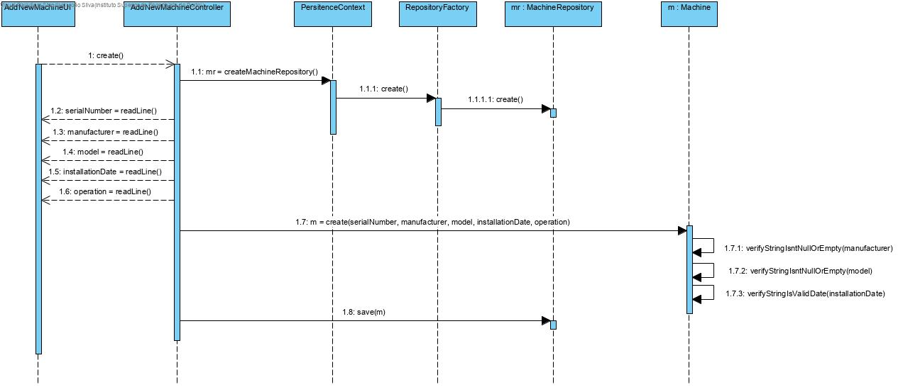

# UC 3001 - Add New Machine #

## DESIGN ##

Utilizar a estrutura base standard da aplicação baseada em camadas

### CLASSES DO DOMÍNIO ###

* É utilizada a classe *MachineFactory* para efetuar a criação de *Machine*.
* É efetuada a criação e persistência de objetos da classe *Machine*.

### CONTROLADOR ###
* AddNewMachineController

### REPOSITÓRIOS ###
* Utiliza-se o *MachineRepository* para persistir o objeto criado.

### DIAGRAMA DE SEQUÊNCIA ###

