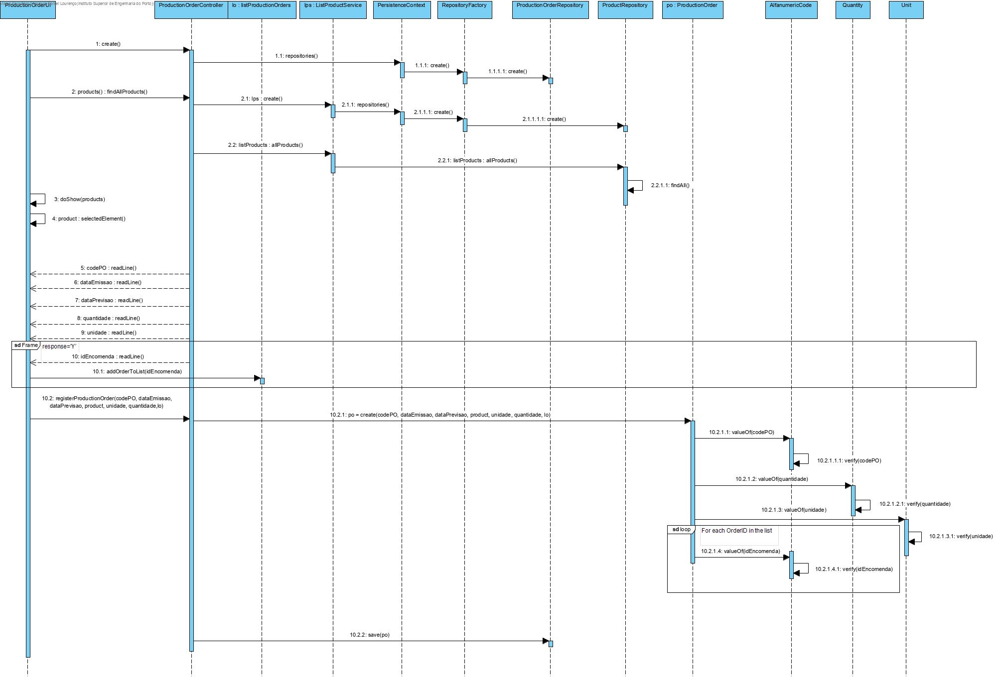

# UC 2010 - Add New Production Order #

## DESIGN ##

Utilizar a estrutura base standard da aplicação baseada em camadas.

### CLASSES DO DOMÍNIO ###

* ProductionOrder
* AlfanumericCode
* Quantity
* Unit
* Request -> Esta classe serve para guardar todos os ids das encomendas.

### CONTROLADOR ###

* addNewProdutionOrderController

### REPOSITÓRIOS ###

* ProductionOrderRepository
* ProductRepository

### SERVICES ###

* ListProductService

### DIAGRAMA DE SEQUÊNCIA ###

