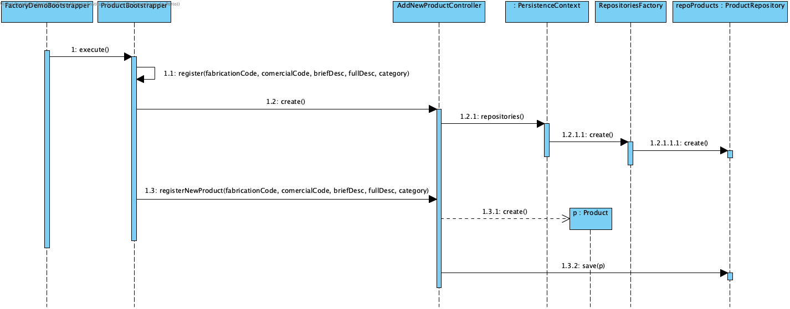

# UC 1006 - Bootstrap Products #

## DESIGN ##

Utilizar a estrutura base standard da aplicação baseada em camadas.

### BOOTSTRAPPER ###

* ProductBootstrapper

### CLASSES DO DOMÍNIO ###

* Product

### CONTROLADOR ###

* AddNewProductController

### REPOSITÓRIOS ###

* RepositoriesFactory
* ProductRepository

### DIAGRAMA DE SEQUÊNCIA ###

