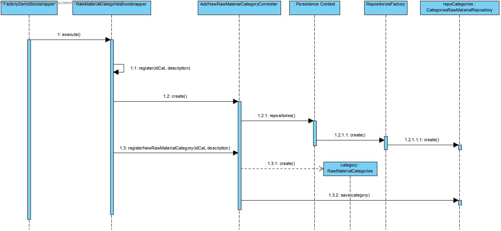

# UC 1005 - Bootstrap Raw Material Category #

## DESIGN ##

Utilizar a estrutura base standard da aplicação baseada em camadas

### CLASSES DO DOMÍNIO ###

* RawMaterialCategories

### CONTROLADOR ###

* AddNewRawMaterialCategoryController.

### REPOSITÓRIOS ###

* CategoriesRepository.

### DIAGRAMA DE SEQUÊNCIA ###

.
