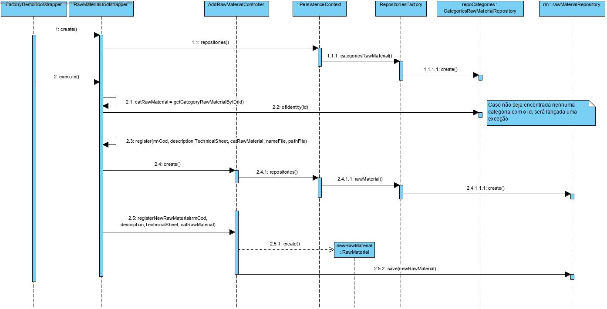

### UC 1004 - Bootstrap Raw Material ###

## DESIGN ##

Utilizar a estrutura base standard da aplicação baseada em camadas

## Classes de Dominio ##

* RawMaterial

## CONTROLERS ##

* AddRawMaterialController

## REPOSITÓRIOS ##

* RepositoryFactory
* CategoriesRawMaterialRepository
* RawMaterialRepository

