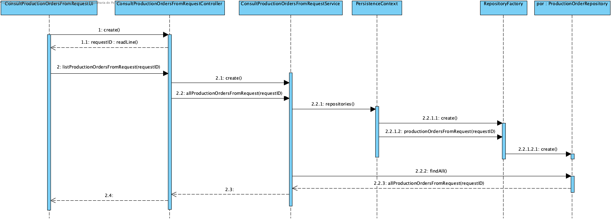

# UC 2012 - Consult Production Orders From Package #

## DESIGN ##

Utilizar a estrutura base standard da aplicação baseada em camadas

### CLASSES DO DOMÍNIO ###

* ProductionOrder

### CONTROLADOR ###
* ConsultProductionOrdersFromPackage

### REPOSITÓRIOS ###
* ProductionOrderRepository 

### DIAGRAMA DE SEQUÊNCIA ###

