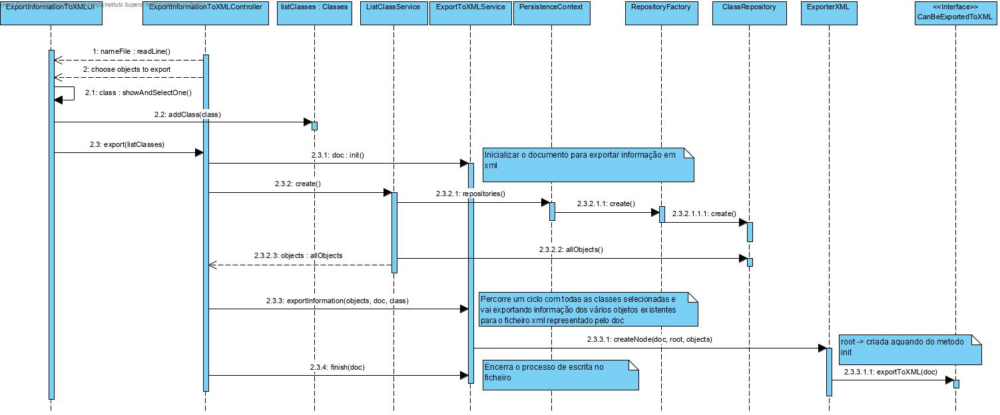

# UC 2007 - Export Information To XML #

## DESIGN ##

Utilizar a estrutura base standard da aplicação baseada em camadas.

### CLASSES DO DOMÍNIO ###

* Product
* RawMaterial
* Machine
* ProductionLine
* RawMaterialCategory
* ProductionOrder
* ProductionSheet
* Lote
* ExecutionProductionOrder

## CLASSES ##

* ExporterXML -> Preenche o ficheiro XML para cada objeto encontrado

### CONTROLADOR ###

* ExportInformationToXMLController

### REPOSITÓRIOS ###

* ProductRepository
* RawMaterialRepository
* MachineRepository
* ProductionLineRepository
* RawMaterialCategoryRepository
* ProductionOrderRepository
* ProductionSheetRepository
* LoteRepository
* ProductionOrderReportRepository

### SERVICES ###

* ListProductService -> procurar todos os conceitos Product
* ListRawMaterialService -> procurar todos os conceitos Raw Material
* ListRawMaterialCategoryService -> procurar todos os conceitos Raw Material Category
* ListMachineService -> procurar todos os conceitos Machine
* ListProducitionOrderService -> procurar todos os conceitos Production Order
* ListProductionSheetService -> procurar todos os conceitos Production Sheet
* ListProductionLineService -> procurar todos os conceitos Production Line
* ListLoteService -> procurar todos os conceitos Lote
* ListProductionOrderReport -> procurar todos os conceitos Production Order Relatory
* ExportXMLService -> responsável por inicializar e finalizar o documento. Percorre um ciclo com todas as classes selecionadas e vai exportando informação dos vários objetos existentes para o ficheiro xml.

### DIAGRAMA DE SEQUÊNCIA ###

### **NOTAS** ###

* No diagrama de sequências apenas está representada a importação de objetos de uma classe genérica para XML, ao invés de todos os conceitos pedidos pelo caso de uso de maneira a evitar redundância de informação. Isto porque as únicas diferenças seriam a mudança do dominío e o respetivo repositório.
