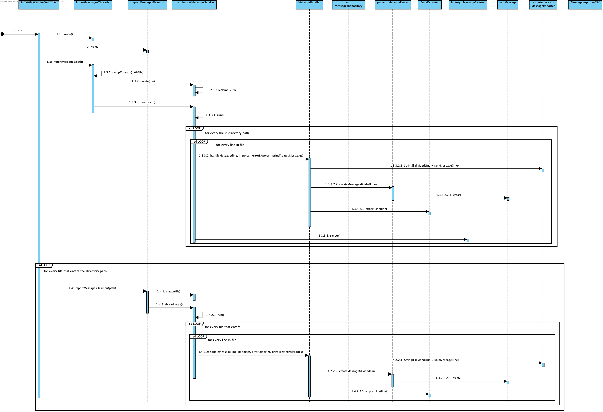

# UC 4001 - Import Messages #

## DESIGN ##

Utilizar a estrutura base standard da aplicação baseada em camadas

### SERVIÇOS ###
* MessageImporterService -> Importaão genérica de mensagens.
* MessageImporterThreads -> Importação de mensagens utilizando threads.
* MessageImporterDeamon -> Importação de mensagens com ativação de um deamon.
* MessageHandler -> Recebe uma linha de uma mensagem, pede ao parser para construir a mensagem, guarda-a no repositório e se necessário exporta erros.
* MessageImporterParser ->  Recebe uma linha de mensagem e utiliza a fábrica de mensagens para criar a mensagem com o código mencionado.

### STRATEGY ###
* MessageImporter ->Interface que permite utilizar diferentes formatos de ficheiros para importar mensagens.
* MessageImporterCSV -> Implementação da interface mencionada que permite importar mensagens de um ficheiro CSV.

### DOMÍNIO ###
* É efetuada a criação de objetos do tipo **Messages** - super classe utilizando a **MessageFactory**.
* Quando identificadas, são criadas mensagens especificas dos seguintes tipos:
    * Mensagem de Consumo
    * Mensagem de Entrega de Produção
    * Mensagem de Produção
    * Mensagem de Estorno
    * Mensagem de Inicio de Atividade
    * Mensagem de Retoma de Atividade
    * Mensagem de Paragem
    * Mensagem de Fim de Atividade
* Caso a mensagem tenha algum erro sintático ou mencione um objeto de domínio que não seja mencionado no respetivo repositório, um objeto **Failure** é criado sendo-lhe atribuido um **FailureType** e **FailureState**.

### REPOSITÓRIOS ###
* As **Messages** criadas serão persistidas no repositório **MessagesRepository**.

### CONTROLADOR ###
* MessagesImporterController

### DIAGRAMA DE SEQUÊNCIA ###
