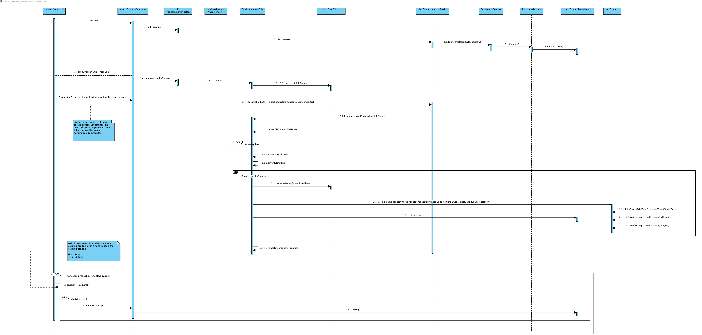

# UC 2005 - Import Products #

## DESIGN ##

Utilizar a estrutura base standard da aplicação baseada em camadas.

* Além da especificação abaixo deve de ser considerada a especificação do [design de UC 2006 - Add New Product](https://bitbucket.org/TiagoMoreiraISEP/lei_isep_2019_20_sem4_2di_1181011_1181012_1181047_1181061_1150/wiki/AddNewProduct_UC_2006/AddNewProduct-DESIGN.md) visto que o processo de adição de produtos (depois de tratar o ficheiro de importação) é semelhante.

### CLASSES DA APLICAÇÃO ###
* **ErrorWritter** é reponsável por escrever para um ficheiro os produtos que possuem erros de formatação.

### CLASSES DE SERVIÇOS ###
* **ProductImporterFactory** é utilizada para criar um determinado importador de acordo com o tipo de ficheiro utilizado.
* **ProductImporter** representa uma interface que é utilizada para estabelecer a ligação entre diversos importadores.
* **ProductImporterCSV** é criado pela **ProductImporterFactory** e utilizado pelo **ProductImporterService** para importar o ficheiro.
* **ProductImporterService** de acordo com o importador especificado trata o ficheiro e adiciona ao sistema caso o produto seja válido.

### CONTROLADOR ###
* ImportProductsController

### PADRÕES ###
* Foi utilizado o padrão *Strategy* visto que pode ser necessário futuramente importar produtos a partir de outro tipo de ficheiros.

### DIAGRAMA DE SEQUÊNCIA ###

### **NOTAS** ###
Se algum dos pontos abaixo não se verificarem, o utilizador receberá uma mensagem com a informação de que um determinado produto não foi possível de ser adicionado e continuará a adicionar os restantes produtos.
* "*1.5.1.5.1: CheckIfBriefDescSizeIsLessThen30(briefDesc)*".
* "*1.5.1.5.2: verifyStringIsntNullOrEmpty(fullDesc)*".
* "*1.5.1.5.3: verifyStringIsntNullOrEmpty(category)*".