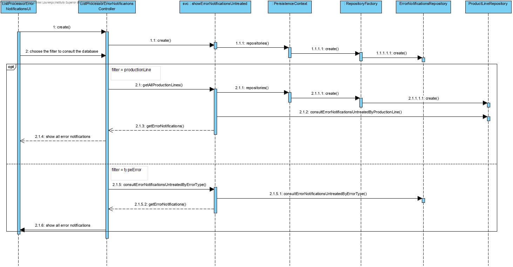

# UC 3005 - List Processor Error Notifications #

## DESIGN ##

Utilizar a estrutura base standard da aplicação baseada em camadas.

### CLASSES DO DOMÍNIO ###

* ErrorNotification
* ErrorNotificationState
* ProductionLine

### CONTROLADOR ###

* ListProcessorErrorController

### REPOSITÓRIOS ###

* ErrorNotificationRepository
* ProductionLineRepository

### Services ###

* ShowErrorNotificationsUntreated

### DIAGRAMA DE SEQUÊNCIA ###

