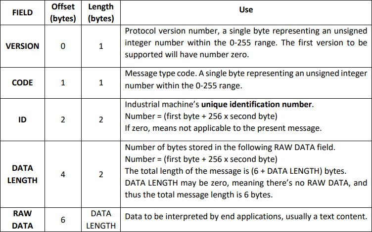
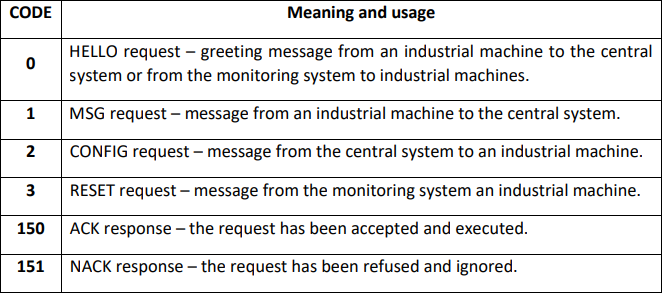

# UC 6001 - Monitor Machines From Production Line

## Pre-Condições

- Deve existir no sistema, máquinas associadas a uma linhas de produção para ser possível monitorizar o seu estado.

## Pós-Condições

- É guardado uma lista com os estados das máquinas ao longo da monitorização realizada.

## ANÁLISE

- Não há conhecimento mútuo inicial.
- As máquinas industriais tornam-se conhecidas pelo sistema de monitorização ao responder a pedidos HELLO remetidos por este.
- As máquinas industriais nunca enviam pedidos ao sistema de monitorização.
- O sistema de monitorização deve possuir uma lista de endereços a ser monitorizados, podendo esta lista conter endereços específicos e/ou de difusão.
- A cada 30 segundos o sistema envia um pedido de HELLO a cada um destes endereços e, a partir das respostas que chegam ao sistema, este deve manter uma lista com as máquinas industriais e as respetivas mensagens.
- Se não houver atualização de uma máquina por mais de um minuto (valor configurável), esta deverá ser marcada como indisponível.
- O sistema de monitorização deve ser capaz de detetar anomalias para facilitar a correção das mesmas.

## REGRAS DE NEGÓCIO

- Só podem ser enviadas mensagens com no máximo 512 bytes.

- Formato Mensagens:

  

- Codigos dos pedidos e respostas:

  
