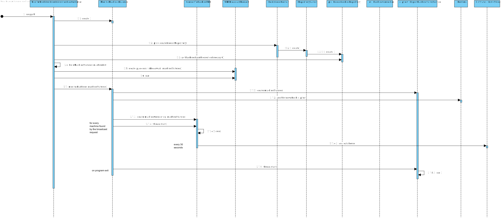

# UC 6001 - Monitor Machines From Production Line

## DESIGN

Utilizar a estrutura base standard da aplicação baseada em camadas.

### SERVIÇOS

- MessageImporterService -> Importaão genérica de mensagens.
- MessageImporterDeamon -> Monitorização de máquinas com ativação por um daemon.
- UDPBroadcastRequest -> Pedidos de broadcast por UDP.
- ConnectToMachineUDP -> Pedidos UDP por unicast para cada máquina com IP encontrado.
- ExportMachineStatusService -> Exportação dos estados lidos das máquinas para um ficheiro de texto

### CLASSES DO DOMÍNIO

- Machine
- ProductionLine

### CONTROLADOR

- MonitorMachinesFromProductionLineController

### REPOSITÓRIOS

- ProductionLineRepository

### DIAGRAMA DE SEQUÊNCIA

