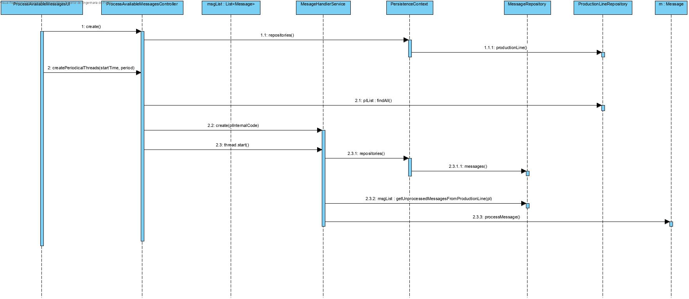

# UC 5002 - Process Available Messages Periodically

## DESIGN

Utilizar a estrutura base standard da aplicação baseada em camadas.

### CLASSES DO DOMÍNIO

- Message
- ActivityEndMessage
- ActivityResumptionMessage
- ActivityStartMessage
- ChargebackMessage
- ConsumptionMessage
- ForcedStopMessage
- ProductionDeliveryMessage
- ProductionMessage

### CONTROLADOR

- ProcessAvailableMessagesController
- MessageHandlerService

### REPOSITÓRIOS

- ProductionLineRepository
- MessageRepository

### DIAGRAMA DE SEQUÊNCIA

