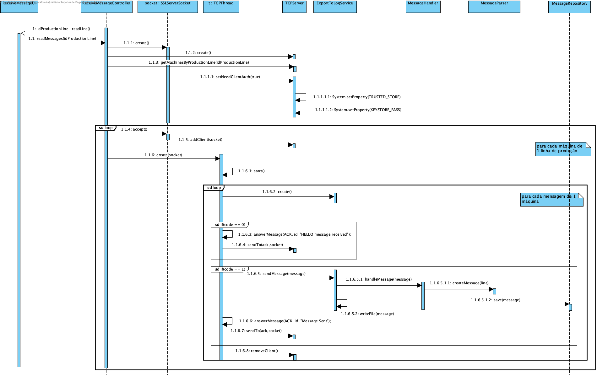

# UC 1013 - Protect Communication Between SCM And Machines #

## DESIGN ##

Utilizar a estrutura base standard da aplicação baseada em camadas

### CLASSES DO DOMÍNIO ###

* Não são utilizadas classes do Domínio.

### CONTROLADOR ###
* ReceiveMessagesController

### REPOSITÓRIOS ###
* MessageRepository 

### DIAGRAMA DE SEQUÊNCIA ###
