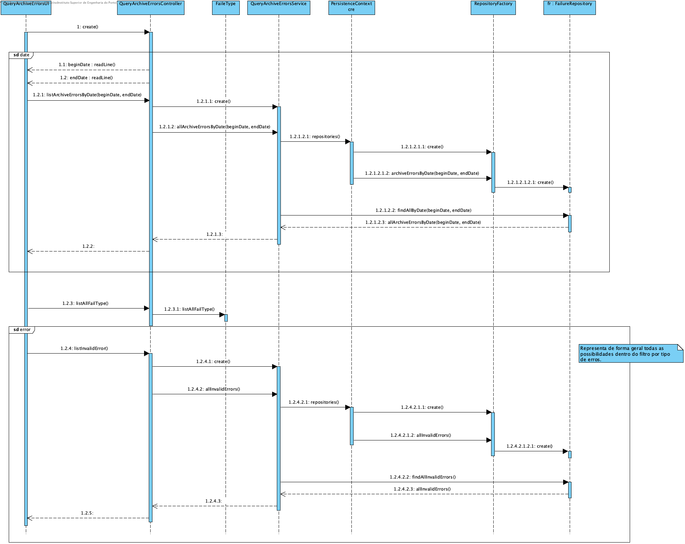

### UC 3007 - Query Archived Errors ###

## DESIGN

Utilizar a estrutura base standard da aplicação baseada em camadas

## CLASSES DE DOMINIO

- Failure

## CONTROLERS

- QueryArchivedErrors

## REPOSITÓRIOS

- FailureRepository

## SERVIÇOS

- **QueryArchivedErrorsService** é responsável por listar todas as falhas existentes no sistema segundo o filtro selecionado.

