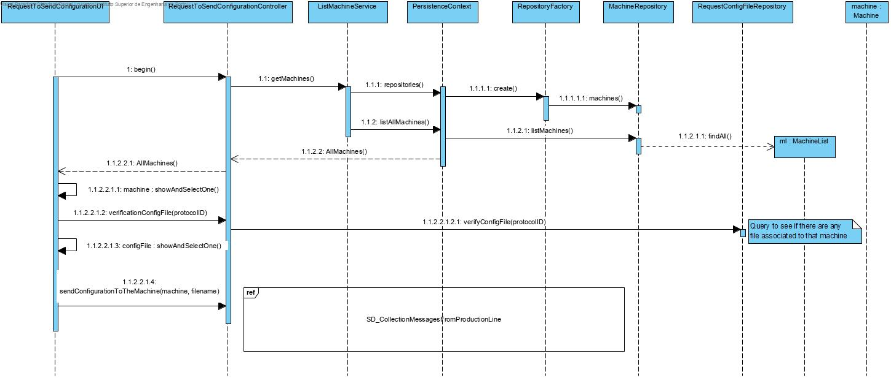
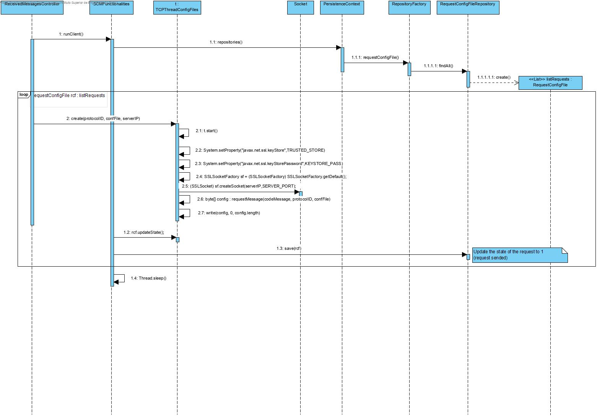

### UC 3010 - Request to send a configuration to the machine ###

# Design #

Utilizar a estrutura base standard da aplicação baseada em camadas.

### CLASSES DO DOMÍNIO ###

* SCMFunctionalities
* Machine

### CONTROLADOR ###

* ReceivedMessagesController
* RequestToSendConfigurationController

### REPOSITÓRIOS ###

* MachineRepository
* RequestConfigFileRepository

### Serviços ###

* ImportFileToBytesService
* ListMachineService

### DIAGRAMA DE SEQUÊNCIA ###

### **NOTAS** ###

Este caso de uso está dependente do UC 3010 - Receção de mensagens. Para que seja enviada uma mensagem de configuração é necessário que a máquina esteja ligada, ou seja, o servidor terá de receber pedidos HELLO por parte do simulador para que o seu ip fique registado. Assim sendo, quando é iniciado o caso de uso 3010 é criada uma thread que fica à espera de pedidos de configuração para a máquina selecionada.
Os pedidos de configuração são guardados na base de dados. A thread responsável por enviar os pedidos de configuração às máquinas dão pull de 10 em 10 segundos à base de dados para ir buscar todos os pedidos e caso a respetiva máquina esteja ligada, a operação de envio continua. No final, o estado do pedido é alterado para 1 (pedido enviado com sucesso).
