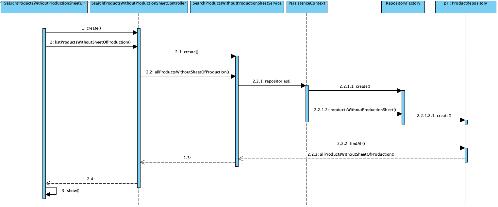

# UC 2003 - Search Products Without Production Sheet #

## DESIGN ##

Utilizar a estrutura base standard da aplicação baseada em camadas

### CLASSES DO DOMÍNIO ###

* Product

### CONTROLADOR ###
* SearchProductsWithoutProductionSheetController

### REPOSITÓRIOS ###
* ProductRepository 

### DIAGRAMA DE SEQUÊNCIA ###

