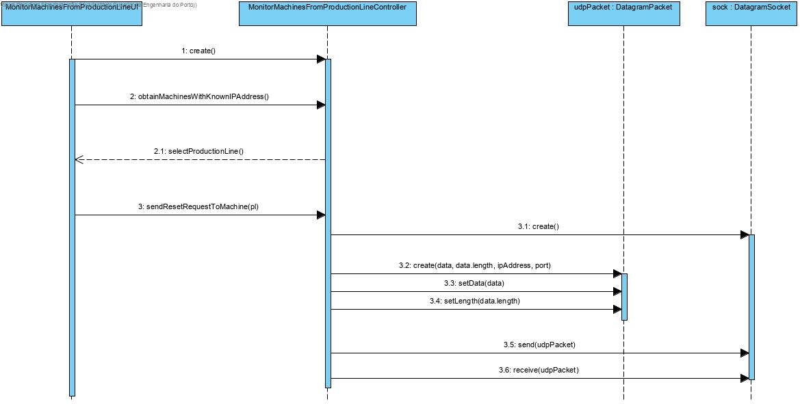

### UC 6002 - Send a restart request to a machine

# Design

Utilizar a estrutura base standard da aplicação baseada em camadas.

### CLASSES DO DOMÍNIO

- MachineConnection

### CONTROLADOR

- MonitorMachinesFromProductionLineController

### DIAGRAMA DE SEQUÊNCIA

