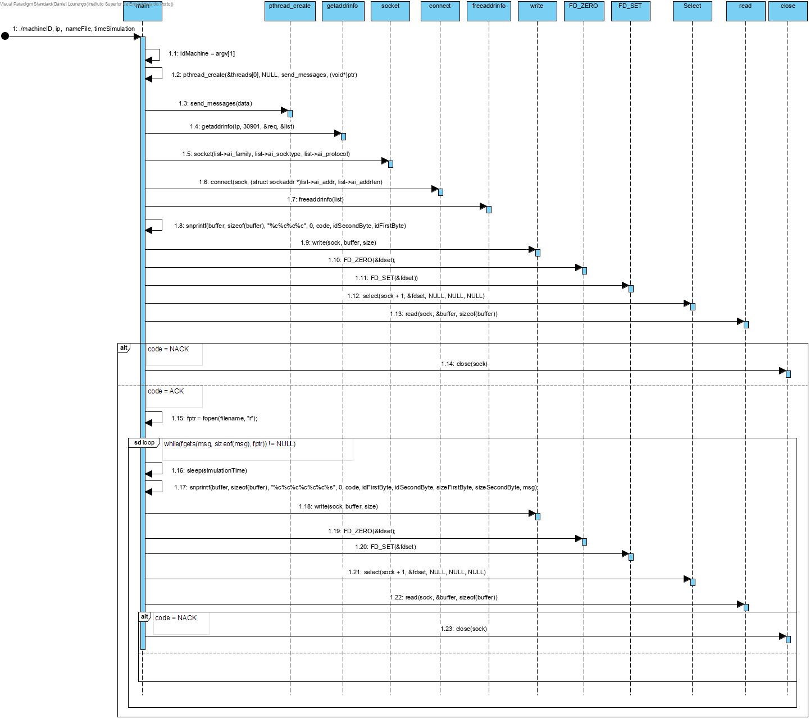

# UC 1011 - Simulate Machine Operation #

Visto que se pretende que esta funcionalidade seja implementada em C, optamos por esquematizar as relações entre diferentes métodos que operam em conjunto para o bom funcionamento do sistema.

### FUNÇÕES UTILIZADAS ###

* send_messages();

### FUNCIONAMENTO DA COMUNICAÇÃO ###

* Será utilizada a porta **30901** para comunicação entre sistemas.
* Inicialmente o Sistema de Simulação da Máquina envia um *HELLO request* para a porta **30901**.
* O servidor responde-lhe com um NACK ou ACK (), dependendo da máquina que está a tentar estabelecer conexão.
* Caso a resposta seja ACK, é permitida a leitura do ficheiro para a simulação do envio de mensagens. Posteriormente é enviada uma *Message request* seguindo o protocolo descrito no enunciado. Caso contrário, a conexão é recusada e a ligação é fechada.
* O servidor responde-lhe com um ACK ou NACK dependendo da máquina que envia o pedido. Caso a resposta seja ACK, este permite continuar a leitura e envio de mensagens, caso contrário a conexão será fechada. Foi adicionado um timout para que caso a ligação ao servidor tivesse com problemas, houvesse a opção de se reconectar para não perder o fluxo de informação.

### DIAGRAMA DE SEQUÊNCIA ###

