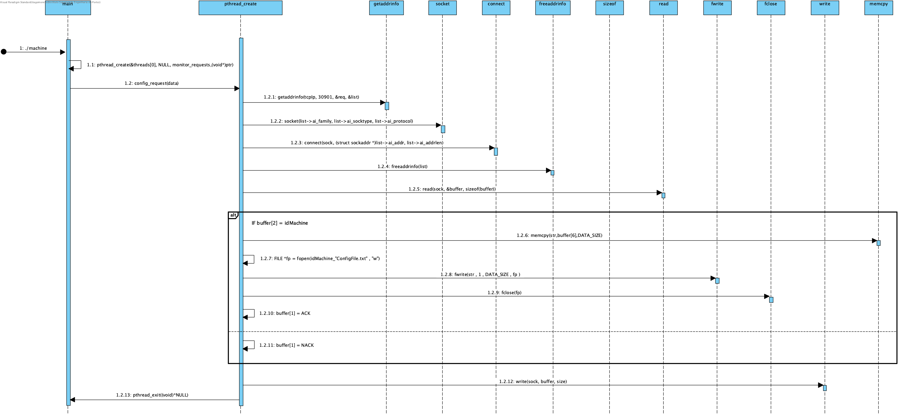

# UC 1014 - Support Configuration File Reception #

## DESIGN ##

Visto que se pretende que esta funcionalidade seja implementada em C, optamos por esquematizar as relações entre diferentes métodos que operam em conjunto para o bom funcionamento do sistema.

### FUNÇÕES UTILIZADAS ###
* createTCPSock
* receiveConfigurationFile

### FUNCIONAMENTO DA COMUNICAÇÃO ###
* Será utilizada a porta **30901** para comunicação entre sistemas.
* Inicialmente o **Sistema de Comunicação com as Máquinas (SCM)** envia um *CONFIG request* para a porta **30901**.
* A Máquina recebe a mensagem e exporta para um ficheiro local o conteúdo do campo **RAW DATA**.

### DIAGRAMA DE SEQUÊNCIA ###
