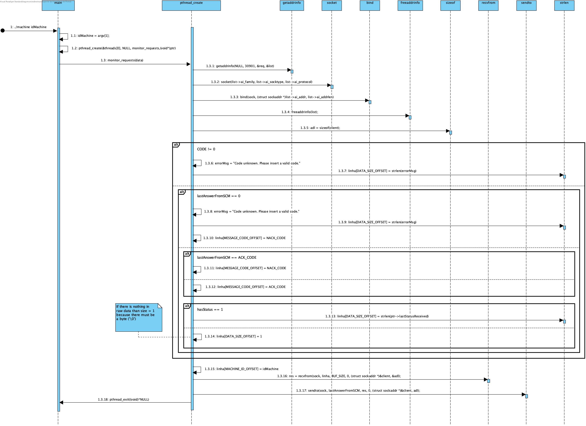

# UC 1012 - Support Monitoring Request #

## DESIGN ##

Visto que se pretende que esta funcionalidade seja implementada em C, optamos por esquematizar as relações entre diferentes métodos que operam em conjunto para o bom funcionamento do sistema.

### FUNÇÕES UTILIZADAS ###
* createUDPSock
* answerToMonitorRequest

### FUNCIONAMENTO DA COMUNICAÇÃO ###
* Será utilizada a porta **30901** para comunicação entre sistemas.
* Inicialmente o Sistema de Monitorização envia um *HELLO request* para a porta **30901** em broadcast.
* A Máquina responde com o seu estado de Comunicação com o Sistema Central (Ligado/Desligado).

### DIAGRAMA DE SEQUÊNCIA ###
