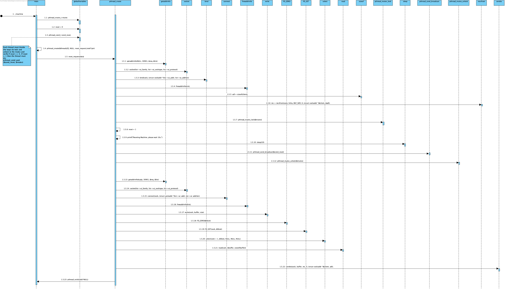

# UC 1016 - Support Reset Request #

## DESIGN ##

Visto que se pretende que esta funcionalidade seja implementada em C, optamos por esquematizar as relações entre diferentes métodos que operam em conjunto para o bom funcionamento do sistema.

### FUNÇÕES UTILIZADAS ###
* createUDPSock
* createTCPSock
* answerToResetRequest

### FUNCIONAMENTO DA COMUNICAÇÃO ###
* Será utilizada a porta **30901** para comunicação entre sistemas.
* Inicialmente o **Sistema de Monitorização (SMM)** envia um *RESET request* para a porta **30901**.
* A Máquina deteta o pedido recebido e envia um *HELLO request* para o **Sistema de Comunicação com as Máquinas (SCM)**.
* A Máquina aguarda pela resposta do **SCM** e reenvia essa resposta para o **SMM** como resposta ao *HELLO request*.
* **NOTA:** Caso a resposta do **SCM** não seja obtida no tempo estipulado e ocorra um *timeout*, será enviado uma resposta com um código de erro como resposta para o **SMM**.

### DIAGRAMA DE SEQUÊNCIA ###
