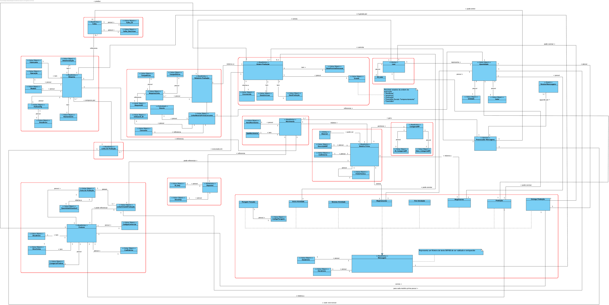

# Projeto Integrador da LEI-ISEP Sem4 2019-20

# 1. Constituição do Grupo de Trabalho

O grupo de trabalho é constituído pelos estudantes identificados na tabela seguinte.

| Aluno Nr. | Nome do Aluno   |
| --------- | --------------- |
| 1150736   | Tiago Sousa     |
| 1181011   | Tiago Moreira   |
| 1181012   | Tiago Moreira   |
| 1181047   | Daniel Lourenço |
| 1181061   | João Silva      |

# 2. Distribuição de Funcionalidades

A distribuição de requisitos/funcionalidades ao longo do período de desenvolvimento do projeto pelos elementos do grupo de trabalho realizou-se conforme descrito na tabela seguinte.

| Aluno Nr. | Sprint B                                                                                                                               | SPRINT C                                                                                                                                  | SPRINT D                                                                                                                                                 |
| --------- | -------------------------------------------------------------------------------------------------------------------------------------- | ----------------------------------------------------------------------------------------------------------------------------------------- | -------------------------------------------------------------------------------------------------------------------------------------------------------- |
| 1150736   | [BootstrapDeposits](documentacao/BootstrapDeposits_UC_1009/BootstrapDeposits.md)                                                       | [ListProductionOrdersByState](documentacao/ListProductionOrdersByState_UC_2011/ListProductionOrdersByState.md)                            |
|           | [SpecifyNewDeposit](documentacao/SpecifyNewDeposit_UC_3003/SpecifyNewDeposit.md)                                                       | [ErrorNotificationArchive](documentacao/ErrorNotificationArchive_UC_3006/ErrorNotificationArchive.md)                                     |
|           | [SpecifyNewProductionLine](documentacao/SpecifyNewProductionLine_UC_3002/SpecifyNewProductionLine.md)                                  |                                                                                                                                           |
| 1181011   | [SpecifyProductionSheetOfProduct](documentacao/SpecifyProductionSheetOfProduct_UC_2004/SpecifyProductionSheetofProduct.md)             | [SpecifyXSD](documentacao/SpecifyXSD_UC_1010/SpecifyXSD.md)                                                                               | [SupportResetRequests](documentacao/SupportResetRequests_UC_1016/SupportResetRequests.md)                                                                |
|           | [ImportProducts](documentacao/ImportProducts_UC_2005/ImportProducts.md)                                                                | [ImportProductionOrders](documentacao/ImportProductionOrders_UC_2009/ImportProductionOrders.md)                                           | [SupportConfigurationFileReception](documentacao/SupportConfigurationFileReception_UC_1014/SupportConfigurationFileReception.md)                         |
|           | [AddNewProduct](documentacao/AddNewProduct_UC_2006/AddNewProduct.md)                                                                   | [ImportMessages](documentacao/ImportMessages_UC_4001/ImportMessages.md)                                                                   |
|           |                                                                                                                                        | [SuportMonitoringRequests](documentacao/SupportMonitoringRequests_UC_1012/SupportMonitoringRequests.md)                                   |
| 1181012   | [AddNewRawMaterialCategory](documentacao/AddNewRawMaterialCategory_UC_2002/AddNewRawMaterialCategory)                                  | [QueryArchivedErrors](documentacao/QueryArchivedErrors_UC_3007/QueryArchivedErrors.md)                                                    |
|           | [BootstrapProducts](documentacao/BootstrapProducts_UC_1006/BootstrapProducts)                                                          | [CollectionMessagesFromProductionLine](documentacao/CollectionMessagesFromProductionLine_UC_4002/CollectionMessagesFromProductionLine.md) |
|           | [SearchProductsWithoutProductionSheet](documentacao/SearchProductsWithoutProductionSheet_UC_2003/SearchProductsWithoutProductionSheet) | [ConsultProductionOrdersFromPackage](documentacao/ConsultProductionOrdersFromPackage_UC_2012/ConsultProductionOrdersFromPackage.md)       |
| 1181047   | [BootstrapRawMaterial](documentacao/BootstrapRawMaterial_UC_1004/BootstrapRawMaterial)                                                 | [ExportInformationToXML](documentacao/ExportInformationToXML_UC_2007/ExportInformationToXML.md)                                           | [SendConfigurationFile](documentacao/RequestToSendConfiguration_UC_3010/RequestToSendConfiguration.md)                                                   |
|           | [AddRawMaterial](documentacao/AddRawMaterial_UC_2001/AddRawMaterial.md)                                                                | [ListProcessingErrorNotifications](documentacao/ListProcessingErrorNotifications_UC_3005/ListProcessingErrorNotifications.md)             | [ProtectCommunicationBetweenMachinesAndSCM](documentacao/ProtectCommunicationBetweenMachinesAndSCM_UC_1015/ProtectCommunicationBetweenMachinesAndSCM.md) |
|           | [BootstrapRawMaterialCategories](documentacao/BootstrapRawMaterialCategories_UC_1005/BootstrapRawMaterialCategories.md)                | [SimulateMachineOperation](documentacao/SimulateMachineOperation_UC_1011/SimulateMachineOperation.md)                                     |
| 1181061   | ProjectConfiguration                                                                                                                   |                                                                                                                                           | [SendRestartRequestToMachine](documentacao/SendRestartRequestToMachine_6002/SendRestartRequestToMachine.md)                                              |
|           | [BootstrapMachines](documentacao/BootstrapMachines_UC_1007/BootstrapMachines.md)                                                       | [SpecifyMachineConfigurationFile](documentacao/SpecifyMachineConfigurationFile_UC_3004/SpecifyMachineConfigurationFile.md)                | [ProcessAvailableMessagesPeriodically](documentacao/ProcessAvailableMessagesPeriodically_5002/ProcessAvailableMessagesPeriodically.md)                   |
|           | [AddNewMachine](documentacao/AddNewMachine_UC_3001/AddNewMachine.md)                                                                   | [MonitorMachinesFromProductionLine](documentacao/MonitorMachinesFromProductionLine_UC_6001/MonitorMachinesFromProductionLine.md)          |
|           | [BootstrapProductionLines](documentacao/BootstrapProductionLines_UC_1008/BootstrapProductionLines.md)                                  |

# 3. Modelo de Domínio

