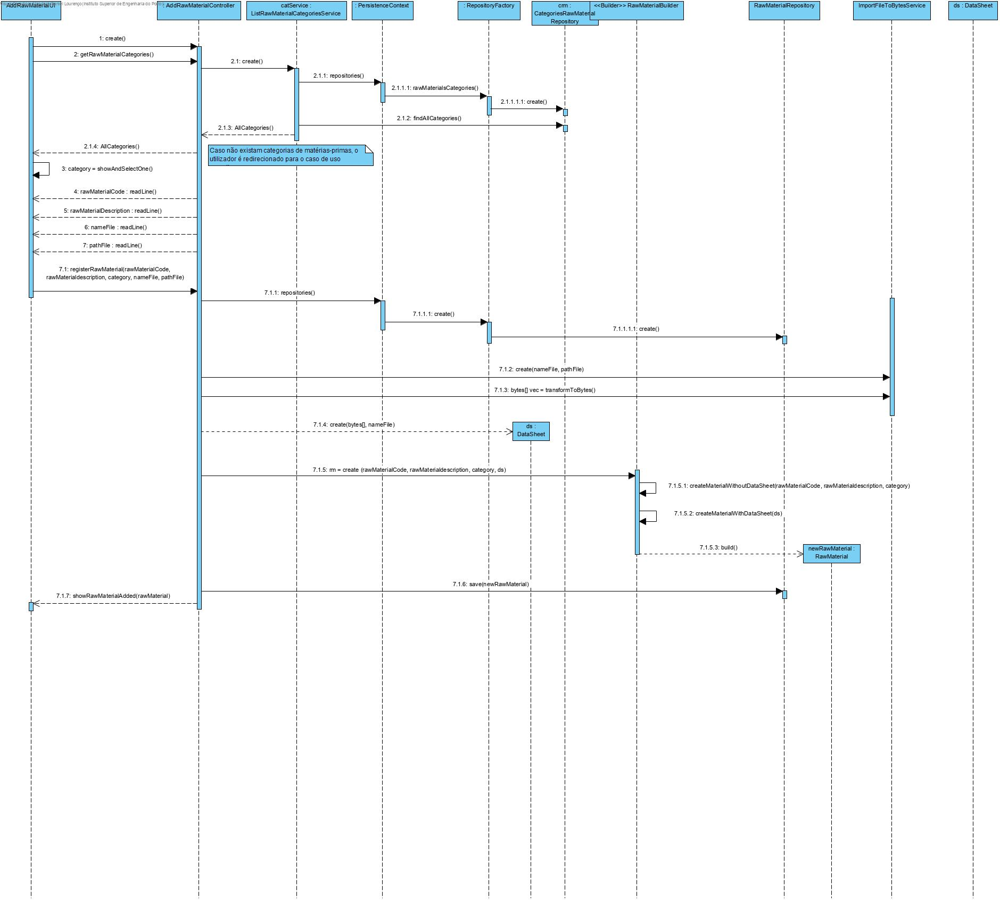

### UC 2001 - Add Raw Material ###

## DESIGN ##

Utilizar a estrutura base standard da aplicação baseada em camadas

## CLASSES DE DOMINIO ##

* RawMaterial
* DataSheet

## CONTROLERS ##

* AddRawMaterialController

## REPOSITÓRIOS ##

* RepositoryFactory
* CategoriesRawMaterialRepository
* RawMaterialRepository

## SERVIÇOS ##

* **ListRawMaterialCategoriesService** é responsável por listar todas as categorias de matérias-primas para posteriormente serem utilizadas para a criação de matérias-primas.
* **ImportFileToBytesService** é responsável por transformar o conteúdo do ficheiro num vetor de bytes para posteriormente ser armazenado na base de dados

## BUILDERS ##

* RawMaterialBuilder -> construção de matérias-primas.

### **NOTAS** ###
Caso ainda não existam categorias criadas, a criação de uma matéria-prima fica condicionada sendo apresentada ao utilizador a opção de adicionar uma categoria de uma matéria-prima. Caso ele aceite, será redirecionado para o respetivo caso de uso, caso contrário, o programa lança uma exceção.
Se o ficheiro correspondente à ficha técnica estiver vazio, o programa notifica o utilizador e lança uma exceção.
