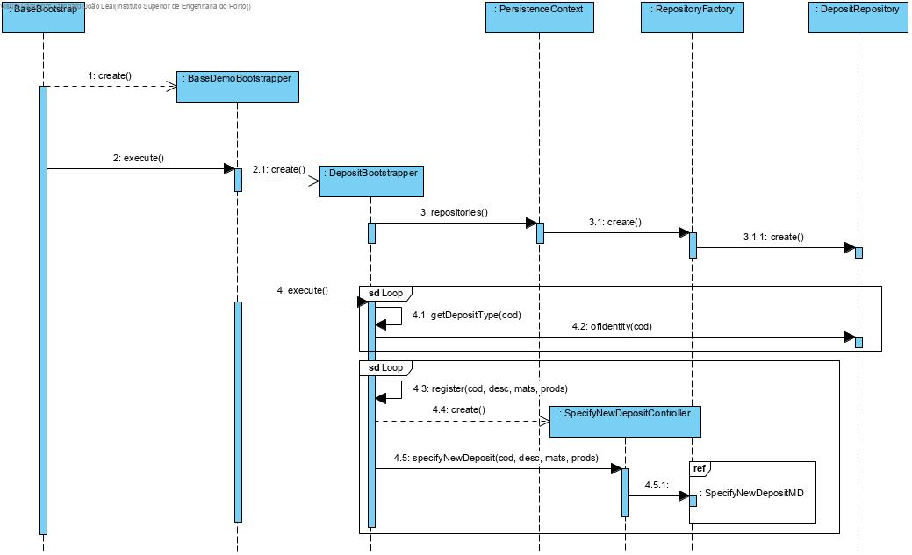

# UC 1009 - Bootstrap Deposits #

## DESIGN ##

Utilizar a estrutura base standard da aplicação baseada em camadas

### BOOTSTRAPPER ###

* DepositBootsraper

### CLASSES DO DOMÍNIO ###

* Deposit

### CONTROLADOR ###

* AddNewDepositController

### REPOSITÓRIOS ###

* DepositRepository
  
### PADRÕES ###

* Foi utilizado o padrão Factory para proceder à criação de categorias.

### DIAGRAMA DE SEQUÊNCIA ###

