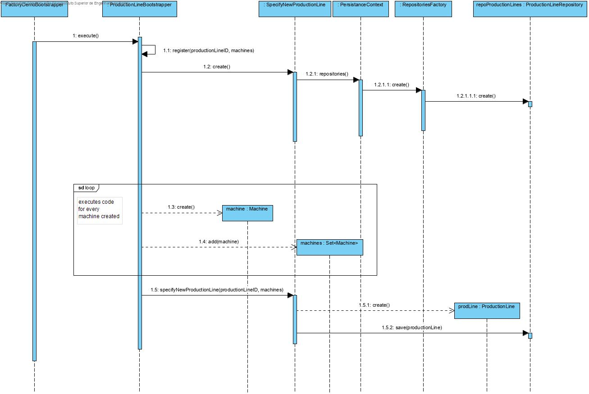

# UC 1008 - Bootstrap Production Lines #

## DESIGN ##

Utilizar a estrutura base standard da aplicação baseada em camadas

### BOOTSTRAPPER ###

* ProductionLineBootstrapper

### CLASSES DO DOMÍNIO ###

* Machine
* ProductionLine

### CONTROLADOR ###

* SpecifyNewProductionLineController

### REPOSITÓRIOS ###

* MachineRepository
* ProductionLineRepository

### DIAGRAMA DE SEQUÊNCIA ###

