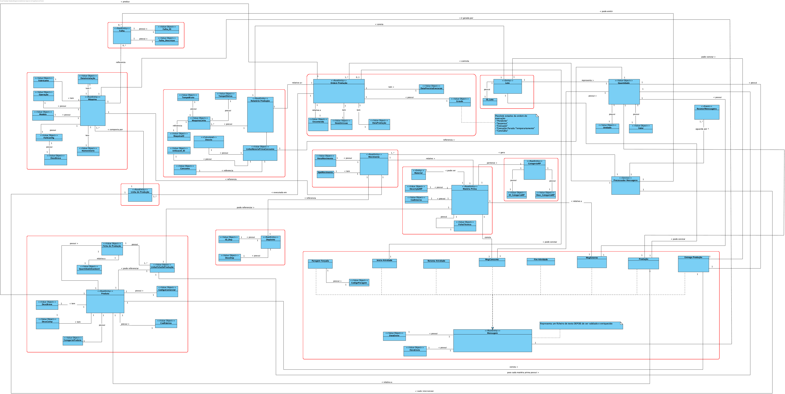

# Projeto Integrador da LEI-ISEP Sem4 2019-20

# 1. Constituição do Grupo de Trabalho

O grupo de trabalho é constituído pelos estudantes identificados na tabela seguinte.

| Aluno Nr.|         Nome do Aluno	       |
|----------|-------------------------------|
| 1150736  |           Tiago Sousa         |
| 1181011  |          Tiago Moreira        |
| 1181012  |          Tiago Moreira        |
| 1181047  |         Daniel Lourenço       |
| 1181061  |           João Silva          |

# 2. Distribuição de Funcionalidades ###

A distribuição de requisitos/funcionalidades ao longo do período de desenvolvimento do projeto pelos elementos do grupo de trabalho realizou-se conforme descrito na tabela seguinte.

|Aluno Nr.|                                                        Sprint B                                                            | SPRINT C |
|-------- |----------------------------------------------------------------------------------------------------------------------------|-------------------------------------------------------------------------|
| 1150736 |                  [BootstrapDeposits](BootstrapDeposits_UC_1009/BootstrapDeposits.md)                                       |
|         |                  [SpecifyNewDeposit](SpecifyNewDeposit_UC_3003/SpecifyNewDeposit.md)                                       |
|         |              [SpecifyNewProductionLine](SpecifyNewProductionLine_UC_3002/SpecifyNewProductionLine.md)                      |
| 1181011 |      [SpecifyProductionSheetOfProduct](SpecifyProductionSheetOfProduct_UC_2004/SpecifyProductionSheetofProduct.md)         | [SpecifyXSD](SpecifyXSD_UC_1010/SpecifyXSD.md) |
|         |                        [ImportProducts](ImportProducts_UC_2005/ImportProducts.md)                                          | [ImportProductionOrders](ImportProductionOrders_UC_2009/ImportProductionOrders.md) |
|         |                       [AddNewProduct](AddNewProduct_UC_2006/AddNewProduct.md)                                              | [ImportMessages](ImportMessages_UC_1012/ImportMessages.md)|
|         |                                                                                                                            | [SuportMonitoringRequests](SuportMonitoringRequests_UC_4001/SuportMonitoringRequests.md) |
| 1181012 |            [AddNewRawMaterialCategory](AddNewRawMaterialCategory_UC_2002/AddNewRawMaterialCategory)                        |
|         |                   [BootstrapProducts](BootstrapProducts_UC_1006/BootstrapProducts)                                         |
|         | [SearchProductsWithoutProductionSheet](SearchProductsWithoutProductionSheet_UC_2003/SearchProductsWithoutProductionSheet)  |
| 1181047 |                [BootstrapRawMaterial](BootstrapRawMaterial_UC_1004/BootstrapRawMaterial)                                   |
|         |                      [AddRawMaterial](AddRawMaterial_UC_2001/AddRawMaterial.md)                                            |
|         |       [BootstrapRawMaterialCategories](BootstrapRawMaterialCategories_UC_1005/BootstrapRawMaterialCategories.md)           |
| 1181061 |                    [ProjectConfiguration](/docs/ProjectConfiguration)                                                      |
|         |                    [BootstrapMachines](BootstrapMachines_UC_1007/BootstrapMachines.md)                                     |
|         |                       [AddNewMachine](AddNewMachine_UC_3001/AddNewMachine.md)                                              |
|         |         [BootstrapProductionLines](BootstrapProductionLines_UC_1008/BootstrapProductionLines.md)                           |

# 3. Modelo de Domínio ###

