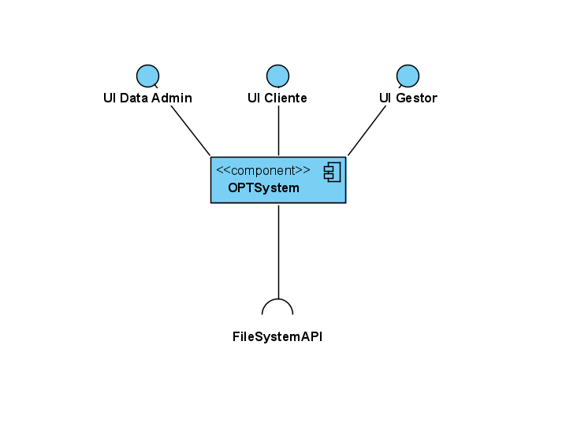
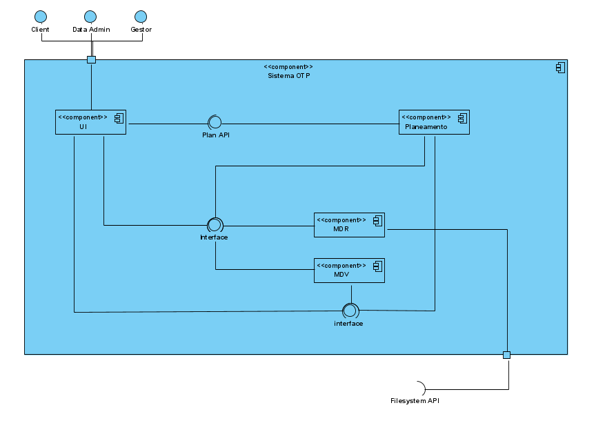
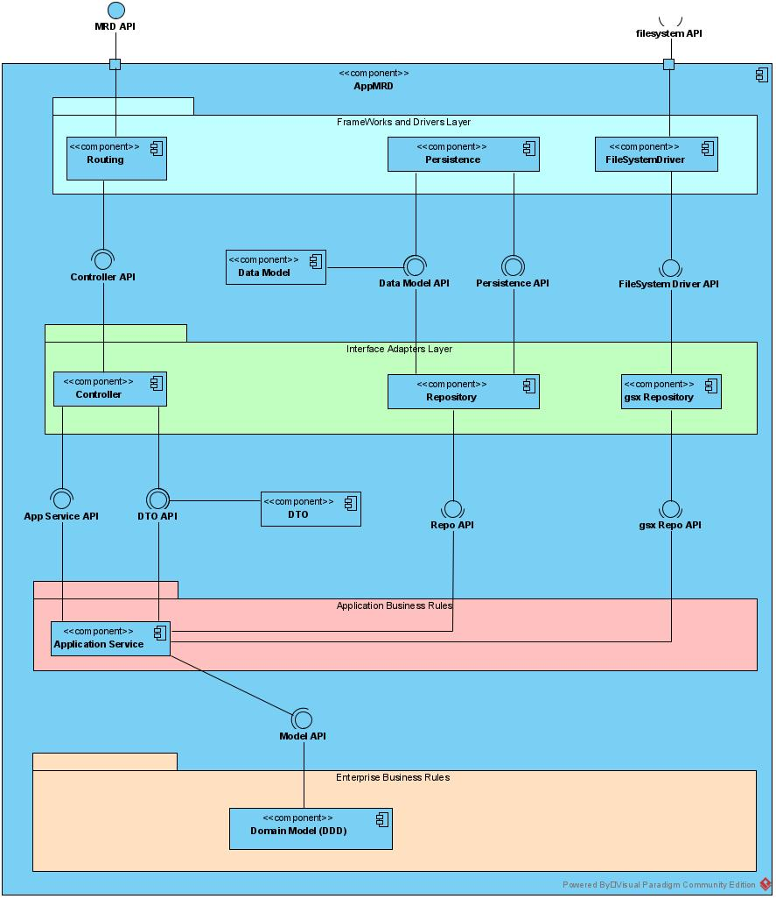
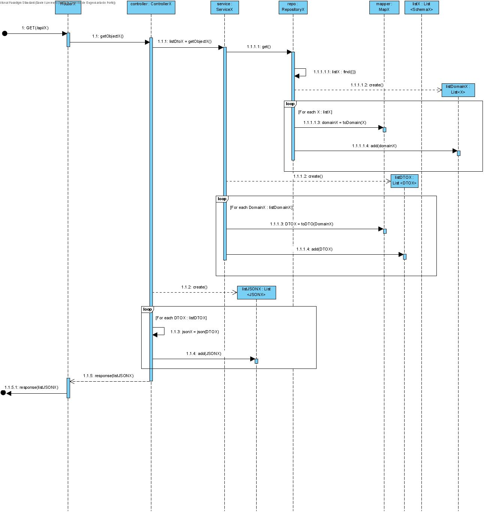
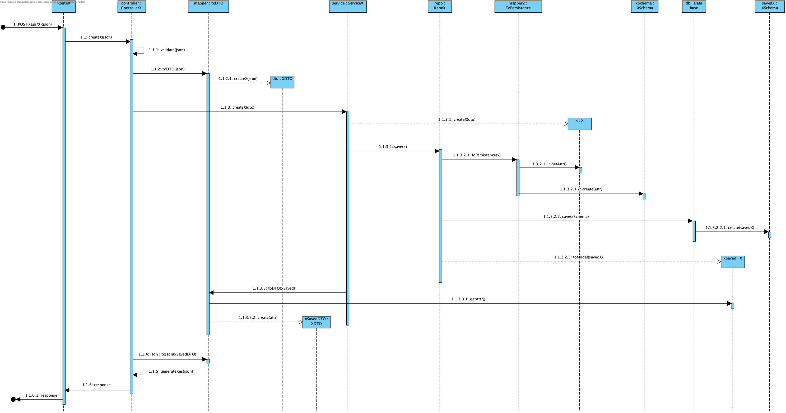

# **DESIGN** #

Throughout this project the team followed an Onion Architecture to better suit our requirements.

## **Architectural Design** ##

### First Logic Level ###

### Second Logic Level ###

### Third Logic Level ###

## **DIAGRAMS** ##
All the functionalities require the use of CRUD operations in HTML, so the team decided to use the same methodology in every HTML request type. With this thought in mind we have developed an individual diagram for each request type. 

#### **GET** ####

#### **POST** ####
