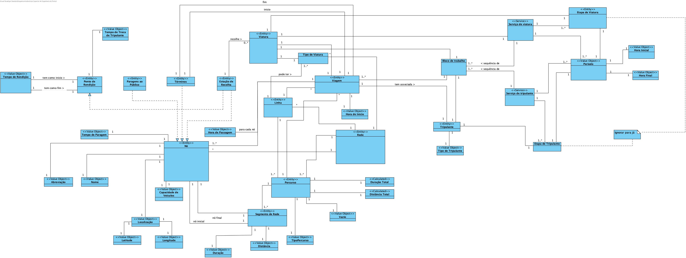
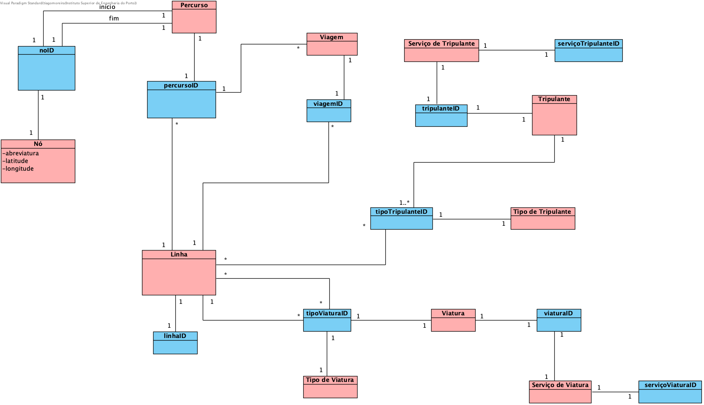

# Project LEI-ISEP Sem5 2020-21

# 1. Team

The students who integrate the development team are identified in the following table. 

| Student Number |    Student Name   |
| -------------- | ----------------- |
|     1181011    |   Tiago Moreira   |
|     1181012    |   Tiago Moreira   |
|     1181047    |   Daniel Lourenço |
|     1181061    |   João Silva      |

# 2. Use Case Distribution

The distribution of requirements throughout the project's development period by the elements of the working group was carried out as described in the following table.

| Student Number |   Sprint A   |
| --------- | ----------------- |
|  1181011  | [Import Nodes](Documentation/SPRINT_A/ImportNodes_UC_1A/ImportNodes.md)  |
|           | [Add Line](Documentation/SPRINT_A/AddLine_UC_3/AddLine.md)      |
|           | [Add Driver Type](Documentation/SPRINT_A/AddDriverType_UC_5/AddDriverType.md) |
|  1181012  | [Import Vehicle Type](Documentation/SPRINT_A/ImportVehicleTypes_UC_1D/ImportVehicleTypes.md)|
|           | [Add Node](Documentation/SPRINT_A/AddNode_UC_2/AddNode.md)|
|           | [List Nodes](Documentation/SPRINT_A/ListNodes_UC_7/ListNodes.md)|
|  1181047  | [Add Vehicle Type](Documentation/SPRINT_A/AddVehicleType_UC_6/AddVehicleType.md)| 
|           | [Import Lines](Documentation/SPRINT_A/ImportLineFromFile_UC_1C/ImportLineFromFile.md)|
|           | [List Paths](Documentation/SPRINT_A/ListPaths_UC_9/ListPaths.md)|
|  1181061  | [Add Path](Documentation/SPRINT_A/AddPath_UC_4/AddPath.md)|
|           | [List Lines](Documentation/SPRINT_A/ListLines_UC_8/ListLines.md)|
|           | [Import Paths](Documentation/SPRINT_A/ImportPaths_UC_1B/ImportPaths.md)|
|           | [Import Driver Types](Documentation/SPRINT_A/ImportDriverType_UC_1E/ImportDriverType.md)|

# 3. Domain Model

# 4. Aggregates Model

